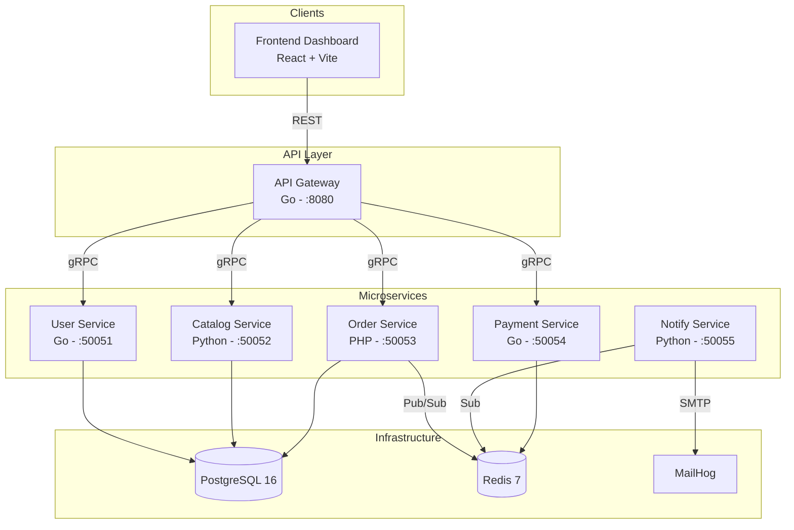

# Architecture NexusFlow

## Vue d'ensemble

NexusFlow est une architecture microservices où chaque service est indépendant, dockerisé et communique via des protocoles standardisés.

## Services



## Protocoles

### gRPC
- **Transport** : HTTP/2
- **Sérialisation** : Protocol Buffers
- **Services** : User, Catalog, Payment
- **Avantages** : Typé, rapide, streaming bidirectionnel

### Redis Pub/Sub
- **Canal** : `nexusflow:notifications`
- **Événements** : `order.created`, `order.status_changed`, `payment.received`
- **Avantages** : Découplage, scalabilité, <1ms latence

## Sécurité

- **JWT** : Tokens HMAC-SHA256, 24h d'expiration
- **Rate Limiting** : Token bucket (100 req/min/IP)
- **RBAC** : Rôles admin/customer
- **PostgreSQL** : Schémas isolés, pas de cross-schema queries
- **Docker** : Réseau interne, ports exposes sélectifs

## Métriques de performance

| Métrique | Objectif | Mesuré |
|----------|----------|---------|
| Latence gRPC | <5ms | — |
| Latence Redis Pub/Sub | <1ms | — |
| Temps démarrage complet | <30s | — |
| Taille image Docker (Go) | ~15MB | — |
| Taille image Docker (Python) | ~150MB | — |

## Patterns implémentés

### 1. API Gateway
Point d'entrée unique : auth, rate limiting, routage.

### 2. Service Isolation
Chaque service a son propre schéma PostgreSQL, ses dépendances, son cycle de vie.

### 3. Event-Driven
Les notifications sont asynchrones via Redis Pub/Sub.

### 4. Health Check
Chaque service expose un endpoint de santé, agrégé par l'API Gateway.

### 5. Graceful Shutdown
Tous les services capturent SIGINT/SIGTERM pour un arrêt propre.

## Diagrammes disponibles

Les diagrammes UML suivants sont disponibles au format PlantUML dans `docs/diagrams/` :

| Diagramme | Fichier | Description |
|-----------|---------|-------------|
| Composants | `composants.puml` | Architecture des 6 microservices, dépendances, protocoles (REST/gRPC/Redis Pub-Sub/SMTP) et data stores (PostgreSQL, Redis, MailHog) |
| Classes | `classes.puml` | Entités métier User, Product, OrderItem, Order, Payment avec attributs, méthodes, relations et enums (OrderStatus, PaymentMethod, PaymentStatus) |
| Séquence (commande) | `sequence_commande.puml` | Flux complet : login → catalogue → création commande → paiement (90% succès) → notifications asynchrones via Redis Pub/Sub → email via MailHog |

Pour générer les PNG/SVG depuis PlantUML :
```bash
# Avec le JAR PlantUML
java -jar plantuml.jar docs/diagrams/*.puml

# Avec Docker
docker run --rm -v $(pwd)/docs/diagrams:/diagrams plantuml/plantuml -tpng /diagrams/*.puml
```
